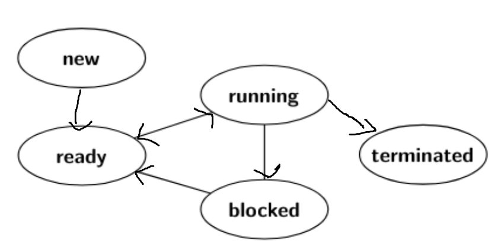

Running -> Ready: Se esta corriendo el proceso y hay una interrupción (de clock o de e/s) por lo que hay que hacer un context switch y el proceso que se estaba ejecutado es pausado por el scheduler y lo pone en ready porque puede seguir ejecutandose. 

Running -> Blocked: Durante la ejecución del proceso este quiere esperar a un resultado de E/S o otro proceso. En vez de perder el tiempo de CPU haciendo nada el proceso cede el tiempo de ejecución pasando a estado bloqueado. El proceso al indicar que esta esperando un recurso, por ejemplo haciendo `sleep()` o `wait()` el scheduler lo pone en estado bloqueado. 
No puede pasar a Ready porque hasta que no este disponible el recurso que esta esperando no se puede ejecutar, por lo que al estar en blocked el scheduler no lo puede elegir para que sea el proximo a ejecutar, porque si siguiera ejecutando estaría perdiendo tiempo de ejecución haciendo busy waiting. 

Running -> Terminated: El proceso le indica al sistema operativo que ya puede liberar todos sus recursos porque termino con exit(). Además le indica a su padre su status de terminación con un numero. Como termino no hace falta dedicarle más tiempo de cpu por lo que pasa al estado terminado. Del estado terminado no se puede mover a ninguno. Entonces al recibir está indicación el scheduler lo marca como proceso terminado. 

Blocked -> Ready: (Preguntar como se entera el scheduler que están listos los recursos que estaba esperando el proceso)

Ready -> Running: El proceso está pausado y cuando llega el momento de ejecutar otro proceso el scheduler, según su politica, elige a este proceso para que siga teniendo tiempo de ejecución. Se actualizan los valores de los registros de acuerdo a los que están guardados en el PCB de este proceso y se le da tiempo de computo. 

New -> Ready: (Preguntar que elementos están involucrados en inicializar la tarea dentro del kernel)