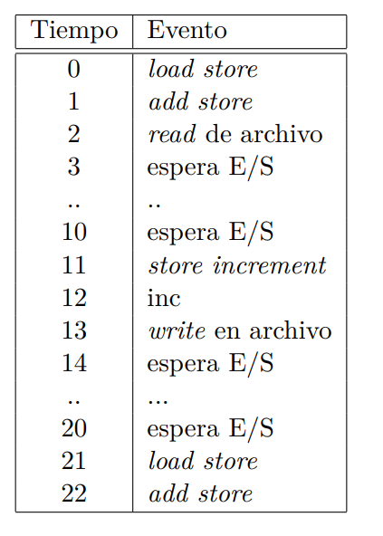

Las rafagas de cpu son: [0-1], [11-12], [21-22].
Las rafagas de E/S son: [2-10], [13-20].

Contando como operaciones de E/S al read/write del archivo.

Las rafagas de cpu tienen duración de dos ciclos de clock y las de E/S 8 y 7.