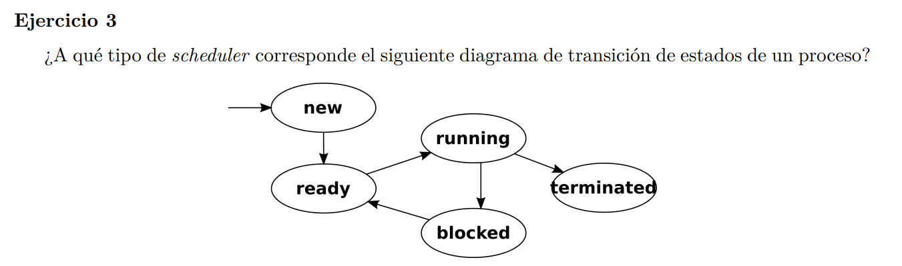

El diagrama de la imagen corresponde a un scheduler nonpreemptive. Porque en uno con desalojo tiene el estado waiting en vez del bloqueado y porque al estar ejecutando nunca puede pasar a ready si no que solo puede pasar a terminado o bloqueado (por E/S). En cambio en un scheduler con desalojo se puede pasar de running a ready si llego termino el quantum del proceso y hay que ejecutar otro. 