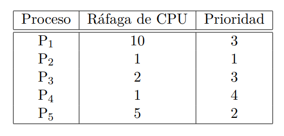

### FCFS: 
Diagrama de Gantt:

Tiempo:  |  0        10 11 12 13        18
         |  P1-------|P2|P3|P4|---------P5
         |===========|==|==|==|==========

Detalle:
P1: [0 - 10]  
P2: [10 - 11]  
P3: [11 - 13]  
P4: [13 - 18]  