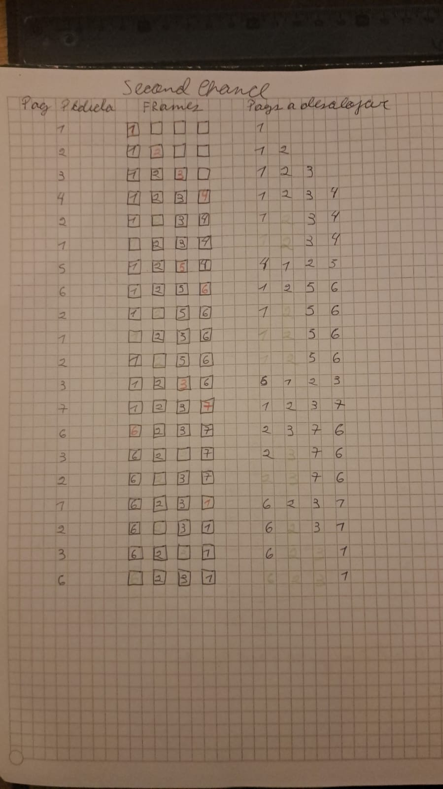

Para toda política de reemplazo, si tenemos un solo frame, cada vez que haya una referencia a una página vamos a tener un page fault, porque en la secuencia del ejercicio nunca se accede dos veces seguidas a la misma página. Así que habrá 20 page faults.
Sea cual sea la política, como solo podemos tener una página en memoria a la vez, siempre vamos a reemplazarla si la que tenemos que leer no es la que tenemos en memoria actualmente.

Por otro lado, para cualquier política de reemplazo, si tenemos 7 frames, solo habrá un page fault al cargar por primera vez cada página, pero nunca será necesario reemplazar una página, ya que tenemos frames suficientes para todas.
Por lo tanto, una vez que cargamos una página por primera vez, cada vez que la necesitemos será un hit asegurado. Así que solo habrá 7 page faults.

Realizo las tablas solo para los casos en que tenemos 4 frames.

### Usando LRU

| Página pedida | Frames | Páginas a desalojar |
|---------------|---------------------------|---------------------|
| 1             | [1, _, _, _] | 1                   |
| 2             | [1, 2, _, _] | 1 2                 |
| 3             | [1, 2, 3, _] | 1 2 3               |
| 4             | [1, 2, 3, 4] | 1 2 3 4             |
| 2             | [1, 2, 3, 4] | 1 3 4 2             |
| 1             | [1, 2, 3, 4] | 3 4 2 1             |
| 5             | [5, 2, 3, 4] | 4 2 1 5             |
| 6             | [5, 6, 3, 4] | 2 1 5 6             |
| 2             | [5, 6, 2, 4] | 1 5 6 2             |
| 1             | [1, 6, 2, 4] | 5 6 2 1             |
| 2             | [1, 6, 2, 4] | 5 6 1 2             |
| 3             | [3, 6, 2, 4] | 6 1 2 3             |
| 7             | [3, 7, 2, 4] | 1 2 3 7             |
| 6             | [3, 7, 2, 6] | 2 3 7 6             |
| 3             | [3, 7, 2, 6] | 2 7 6 3             |
| 2             | [3, 7, 2, 6] | 7 6 3 2             |
| 1             | [1, 7, 2, 6] | 6 3 2 1             |
| 2             | [1, 7, 2, 6] | 6 3 1 2             |
| 3             | [1, 7, 3, 6] | 6 1 2 3             |
| 6             | [1, 7, 3, 6] | 1 2 3 6             |

En total hay 10 Page Faults.

### Usando FIFO 

| Página pedida | Frames después de cargar | Cola de desalojos (de primero a último) |
|---------------|---------------------------|-----------------------------------------|
| 1             | [1, _, _, _] | 1 |
| 2             | [1, 2, _, _] | 1 2 |
| 3             | [1, 2, 3, _] | 1 2 3 |
| 4             | [1, 2, 3, 4] | 1 2 3 4 |
| 2             | [1, 2, 3, 4] | 1 2 3 4 |
| 1             | [1, 2, 3, 4] | 1 2 3 4 |
| 5             | [5, 2, 3, 4] | 2 3 4 5 |
| 6             | [5, 6, 3, 4] | 3 4 5 6 |
| 2             | [5, 6, 2, 4] | 4 5 6 2 |
| 1             | [5, 6, 2, 1] | 5 6 2 1 |
| 2             | [5, 6, 2, 1] | 5 6 2 1 |
| 3             | [3, 6, 2, 1] | 6 2 1 3 |
| 7             | [3, 7, 2, 1] | 2 1 3 7 |
| 6             | [3, 7, 6, 1] | 1 3 7 6 |
| 3             | [3, 7, 6, 1] | 1 3 7 6 |
| 2             | [3, 7, 6, 2] | 3 7 6 2 |
| 1             | [1, 7, 6, 2] | 7 6 2 1 |
| 2             | [1, 7, 6, 2, ] | 7 6 2 1 |
| 3             | [1,3, 6, 2] | 6 2 1 3 |
| 6             | [1, 3, 6, 2] | 6 2 1 3 |

En total hay 14 Page Faults.

### Usando Second Chance (Tengo que pasarlo a MarkDown)

En total hay 10 Page Faults

